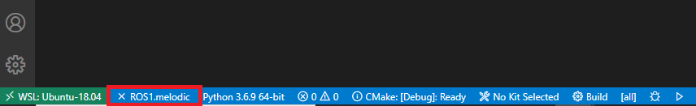

This is an alternative setup to using the native Windows install. There's VS Code integration in WSL that makes it super easy to use. Windows makes their own terminal that I prefer to the one that comes with the Ubuntu installation. I also prefer using the catkin build command from the catkin_tools package rather than catkin_make.

# Basic Setup
1. Follow [Richard's guide](https://github.com/rrcwang/CPSC-515/blob/master/ros_gazebo_wsl/README.md)
1. Install [VSCode](https://code.visualstudio.com/)
1. Install Windows Terminal from the Microsoft Store

# Windows Terminal Setup
I like the Windows Terminal because of how customizable it is. All settings are modified using a JSON file. Plus it has tabs! By default, the terminal opens PowerShell and clicking the + icon at the top of the window will just add more PowerShell tabs. Clicking on the dropdown arrow gives the option for Command Prompt, Azure Cloud Shell, and any WSL installs that you may have. Clicking on our Ubuntu 18.04 installation will open a shell with a working directory of `/mnt/c/Users/<your_user_name>` rather than the expected home directory.

We want to change the default shell to be our Ubuntu installation and the default directory to be the home directory. This can be achieved by the following:

1. Click on the drop down menu and select settings

1. Go to `profiles` -> `list` and find the entry with the name of our WSL installation
    * By default the name will be `Ubuntu-18.04` 
1. Add the following line to entry from the previous step
    * `"startingDirectory": "//wsl$/Ubuntu-18.04/home/<your_wsl_name>/"`
    * Remember to add a comma to the previous line and to replace `<your_wsl_name>` with the name you setup in the Ubuntu installation
    * Now opening the WSL shell will start in the home directory
1. Copy the `guid` attribute's value to the `defaultProfile` attribute located at the top of the settings file
    * This will make the default shell be our WSL shell in the home directory

There are a ton more options that you can play around with like keyboard shortcuts and colour schemes. A partial screenshot of my settings.json file with is shown below.

# VS Code Setup
VS Code has tons of useful extensions that can easilly be installed. To access the extension menu, click on the icon in the sidebar with the 3 stacked blocks and another one floating beside it.

1. Install the "Remote - WSL" extension
    * VS Code should detect WSL automatically and recommend that you install this. If not, search for it in the extensions menu.
    * In WSL shells, we can execute `code .` to open VS Code in the current directory
1. Install the "ROS" extension
    * Adds syntax highlighting for C/C++, Python, launch files, etc.
    * Installs the "C/C++" and "Python" extensions as dependencies
    * You can view information about ROS from within VS Code
    * e.g. at the very bottom of the Window, click on `ROS1.melodic` (might be named something slightly different) to view the topics and services published
    
1. Install the "CMake" extension
    * Adds syntax highlighting for CMakeLists.txt
    * Note: this is different from the "Cmake Tools" extension which is also useful but not necessary
1. Install the "vscode-icons" extension(Optional)
    * Adds many more icons to VS Code, making it easier to recognize filetypes at a glance

# Useful Tips
* Running `explorer.exe .` in the terminal will open Windows Explorer in the current directory
* All WSL installations are accessible in Windows Explorer by navigating to `\\wsl$`
* You can have more than one profile pointing to the same WSL installation but with different settings

# catkin_tools Install (Optional)
I like the build commands for the `catkin_tools` package better than the default ones that come with ROS. The output is also more descriptive if something goes wrong. You can install them [here](https://catkin-tools.readthedocs.io/en/latest/installing.html). You can only use one of `catkin_tools` or `catkin_make` in a workspace at any given time. To change between them, delete the `build` and `devel` folders and run the other command. Note that most tutorials will use the default commands so you will have to do a quick google search if you want to find the right commands to use

* `catkin build` replaces `catkin_make` and can not be used interchangeably (although they can be used in separate workspaces)
* Other commands can be used interchangably
* e.g. `catkin create pkg beginner_tutorials --catkin-deps std_msgs rospy roscpp` or `catkin_create_pkg beginner_tutorials std_msgs rospy roscpp` can both be used
* `catkin build` doesn't have to be run in the root of the workspace once the workspace is already setup
* e.g. running `catkin build` in `~/catkin_ws` will have the same effect as running it in `~/catkin_ws/src`